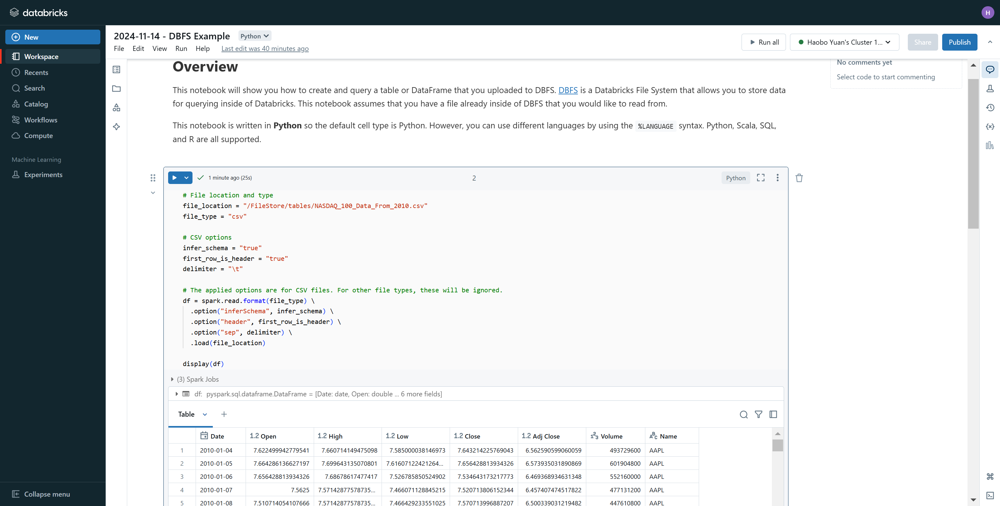
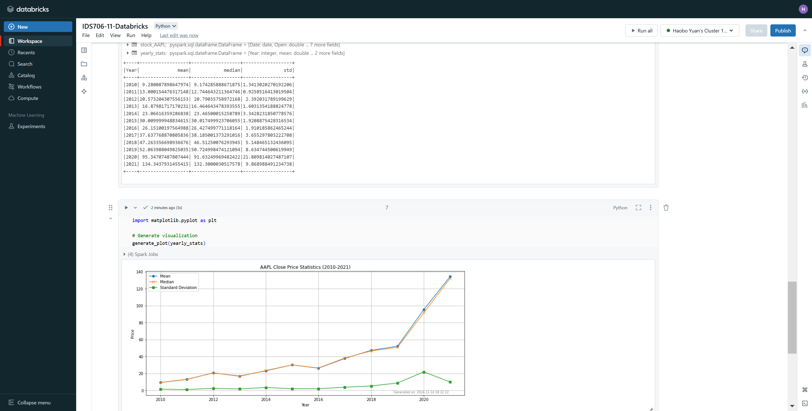

# IDS-706 Data Engineering: Project 11

This is IDS-706 week 11 project which involves Creating a data pipeline using Databricks, and Include at least one data source and one data sink.

## Project Details

[Public Databricks Notebook](https://databricks-prod-cloudfront.cloud.databricks.com/public/4027ec902e239c93eaaa8714f173bcfc/3782939469662119/3034395984167565/143182443765126/latest.html)

Also was exported and available in this repository in [.ipynb](IDS706-11-Databricks.ipynb) and in [.py](IDS706-11-Databricks.py) formats.

There are two screenshots of the notebook run successfully on Databricks.

Load CSV to DBFS:

Analyze and Plot:

### Data Pipeline & Data source and data sink
I successfully created a data pipeline on Databricks that meets the assignment requirements. Here’s a detailed analysis:

#### 1. Data Source
In my project, I used the `NASDAQ_100_Data_From_2010.csv` file from the Databricks File System (DBFS) as the data source. I specified appropriate read options (like `inferSchema` and `header`) to ensure correct data import, storing the data in a Spark DataFrame. This satisfies the requirement to "Include at least one data source."

#### 2. Data Processing and Aggregation
I implemented the `preprocess_data` function to filter and preprocess the data, focusing on AAPL stock and adding a `Year` column. Then, I used `groupBy` and `agg` to calculate annual statistics (mean, median, and standard deviation) for AAPL's closing price. This data processing demonstrates a functional pipeline, addressing the "Pipeline functionality" criterion.

#### 3. Data Sink
I configured two data sinks to save the processed annual statistics:
- **Table Storage**: I saved the data as a table using `spark.write.format("parquet").saveAsTable("AAPL_Yearly_Stats")`, which ensures persistence across cluster restarts.
- **CSV File**: I also saved the data as a CSV file to the path `/FileStore/tables/AAPL_Yearly_Stats.csv` on DBFS, making it easy to download and share in CSV format.

#### Summary
My project have implemented:
- **Data Source**: I used a CSV file from DBFS as the data source.
- **Data Sink**: I saved the results as both a table and a CSV file, ensuring data persistence and accessibility.
- **Pipeline Functionality**: Using Spark, I implemented data preprocessing, aggregation, and generated a visualization of AAPL’s annual statistics.

### Spark SQL Query and Data Transformation

This project includes both data transformations and a Spark SQL query:

- **Data Transformations**: The code utilizes `groupBy` and `agg` functions to calculate the yearly mean, median, and standard deviation of AAPL stock closing prices. These operations are essential for aggregating the data by year and computing relevant statistics.

- **Spark SQL Query**: The `expr` function is used with `percentile_approx` to approximate the median of the closing prices. This function call demonstrates the use of a Spark SQL expression within the PySpark framework, allowing efficient computation of the median value for large datasets.

### Reference
[devcontainer & Dockerfile from Jeremy](https://github.com/nogibjj/Jeremy_Tan_IDS706_Week10/tree/main/.devcontainer)

---

## AAPL Price Statistics (2010-2021)

This project calculates the mean, median,and standard deviation of AAPL stock close prices from 2010 to 2021.

The data is from the everyday close price of <NASDAQ 100 Data From 2010> dataset on Kaggle.
>https://www.kaggle.com/datasets/kalilurrahman/nasdaq100-stock-price-data/data 

The statistics are as follows:
|   Year |      mean |    median |       std |
|-------:|----------:|----------:|----------:|
|   2010 |   9.28009 |   9.18089 |  1.3413   |
|   2011 |  13.0002  |  12.7509  |  0.925852 |
|   2012 |  20.5732  |  20.8032  |  2.39203  |
|   2013 |  16.8798  |  16.467   |  1.60314  |
|   2014 |  23.0662  |  23.475   |  3.34282  |
|   2015 |  30.01    |  30.075   |  1.92089  |
|   2016 |  26.151   |  26.4375  |  1.91019  |
|   2017 |  37.6378  |  38.185   |  3.6553   |
|   2018 |  47.2634  |  46.5125  |  5.14847  |
|   2019 |  52.064   |  50.7537  |  8.63474  |
|   2020 |  95.3471  |  91.6325  | 21.8098   |
|   2021 | 134.344   | 132.42    |  9.86899  |## Description and Conclusion:

## Description and Conclusion:
Apple Inc.'s stock performance from 2010 to 2021 shows significant growth, with the average
price rising from $9.28 to $134.34. The company saw consistent increases in stock value, 
particularly in 2020 and 2021, likely driven by strong demand for electronics during the pandemic
and its market leadership in innovation. While volatility increased in the later years, especially
in 2020 with the standard deviation peaking at 21.81, Apple's overall performance was robust,
reflecting its resilience and growth in the global tech industry.
