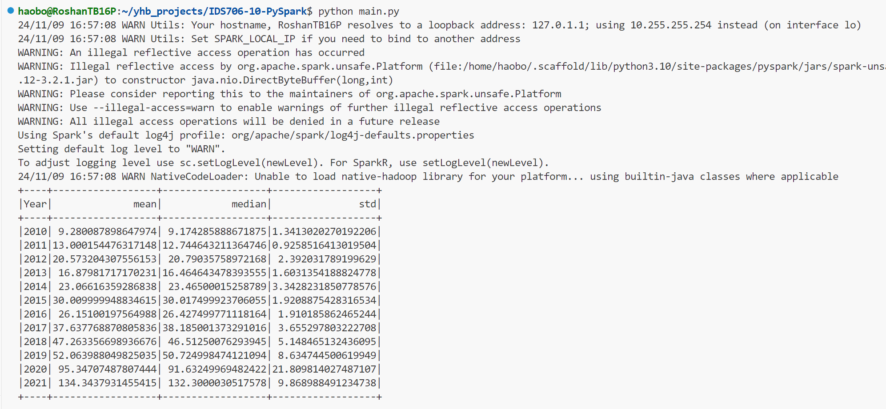
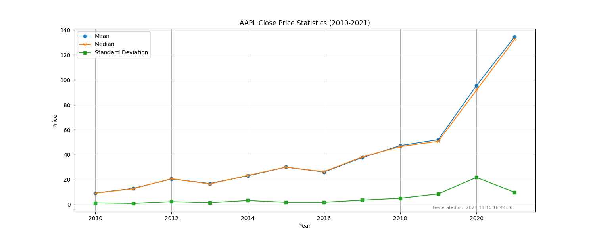

# IDS-706 Data Engineering: Project 10

This is IDS-706 week 10 project which involves using PySpark to perform data processing on a large dataset and includes at least one Spark SQL query and one data transformatio

This project could be implemented locally by installing Spark and PySpark, or by using the GitHub Codespaces with a Linux image. Using DataBricks is also an option, but considering the budget and lots of differences between working on it and on local/Codespaces, DataBricks is not recommended.

## Project Details

### Screenshots of successful run



### Spark SQL Query and Data Transformation

This project includes both data transformations and a Spark SQL query:

- **Data Transformations**: The code utilizes `groupBy` and `agg` functions to calculate the yearly mean, median, and standard deviation of AAPL stock closing prices. These operations are essential for aggregating the data by year and computing relevant statistics.

- **Spark SQL Query**: The `expr` function is used with `percentile_approx` to approximate the median of the closing prices. This function call demonstrates the use of a Spark SQL expression within the PySpark framework, allowing efficient computation of the median value for large datasets.

### Instructions to run the project locally
```bash
# Clone the repository
git clone https://github.com/haobo-yuan/IDS706-10-PySpark.git
# Change the directory
cd IDS706-10-PySpark
# Install the dependencies
make install
# Install Java 11, which is required by Spark
sudo apt update
sudo apt install openjdk-11-jdk
# Add JAVA_HOME to the environment variables
echo "export JAVA_HOME=/usr/lib/jvm/java-11-openjdk-amd64" >> ~/.bashrc
echo "export PATH=$JAVA_HOME/bin:$PATH" >> ~/.bashrc
source ~/.bashrc
# Run the project
make run
```

### Reference
[devcontainer & Dockerfile from Jeremy](https://github.com/nogibjj/Jeremy_Tan_IDS706_Week10/tree/main/.devcontainer)

But I later I choose to run locally. So those files are not really used when running on my end.

---

## AAPL Price Statistics (2010-2021)

This project calculates the mean, median,and standard deviation of AAPL stock close prices from 2010 to 2021.


The data is from the everyday close price of <NASDAQ 100 Data From 2010> dataset on Kaggle.
>https://www.kaggle.com/datasets/kalilurrahman/nasdaq100-stock-price-data/data 

The statistics are as follows:
|   Year |      mean |    median |       std |
|-------:|----------:|----------:|----------:|
|   2010 |   9.28009 |   9.18089 |  1.3413   |
|   2011 |  13.0002  |  12.7509  |  0.925852 |
|   2012 |  20.5732  |  20.8032  |  2.39203  |
|   2013 |  16.8798  |  16.467   |  1.60314  |
|   2014 |  23.0662  |  23.475   |  3.34282  |
|   2015 |  30.01    |  30.075   |  1.92089  |
|   2016 |  26.151   |  26.4375  |  1.91019  |
|   2017 |  37.6378  |  38.185   |  3.6553   |
|   2018 |  47.2634  |  46.5125  |  5.14847  |
|   2019 |  52.064   |  50.7537  |  8.63474  |
|   2020 |  95.3471  |  91.6325  | 21.8098   |
|   2021 | 134.344   | 132.42    |  9.86899  |## Description and Conclusion:




## Description and Conclusion:
Apple Inc.'s stock performance from 2010 to 2021 shows significant growth, with the average
price rising from $9.28 to $134.34. The company saw consistent increases in stock value, 
particularly in 2020 and 2021, likely driven by strong demand for electronics during the pandemic
and its market leadership in innovation. While volatility increased in the later years, especially
in 2020 with the standard deviation peaking at 21.81, Apple's overall performance was robust,
reflecting its resilience and growth in the global tech industry.
